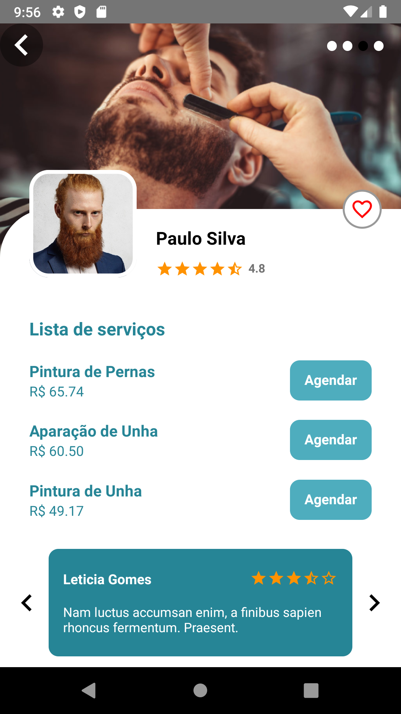
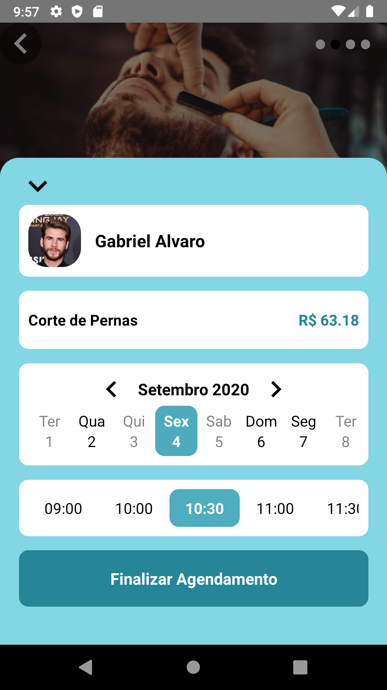

<h1 align="center">
  Salão e Barbearia
</h1>

## 💻 Projeto

<h4>
  Um aplicativo desenvolvido com React Native.  
  Com ele é fácil encontrar barbeiros da sua região e fazer um agendamento com o seu barbeiro favorito.  
  Este aplicativo pode ser adaptado para qualquer seguimento de serviços.  
</h4>

## 🎨 Layout

    
    
    
    

## 💻 Tecnologias

Tecnologias utilizadas para desenvolver esse aplicativo

- [ReactJS](https://reactjs.org/)
- [TypeScript](https://www.typescriptlang.org/)
- [React Router DOM](https://reacttraining.com/react-router/)
- [React Icons](https://react-icons.netlify.com/#/)
- [Styled Components](https://styled-components.com/)
- [Async Storage](https://reactnative.dev/docs/asyncstorage)
- [Geolocation](https://reactnative.dev/docs/geolocation.html)
- [React Native SVG](https://github.com/react-native-community/react-native-svg)
- [Metro](https://facebook.github.io/metro/)
- [Eslint](https://eslint.org/)

## 💻 Instalação

1. `npm install`

2. `npx react-native run-android`

## 📝 Licença

💙 by FAETERJ 2022 - Prof.Vinicius, Jonatas, Eder e Gabriel
